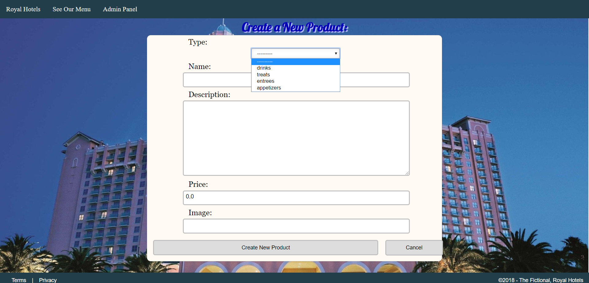
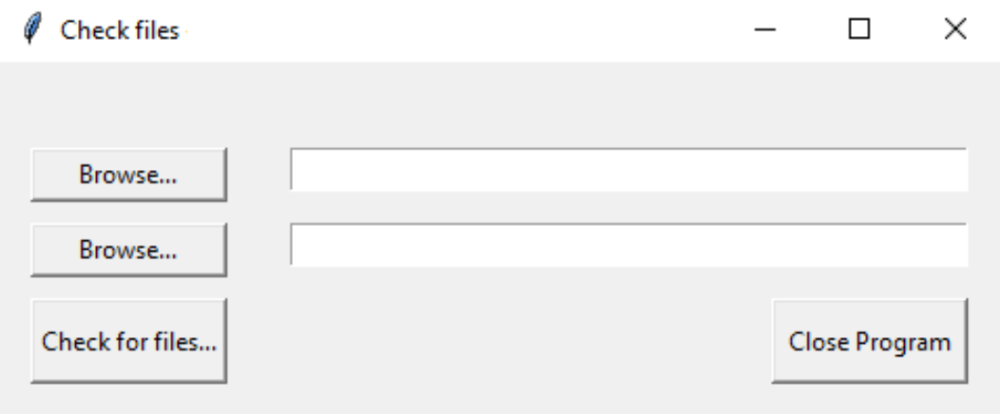

# TTA Python Projects

## Royal Hotels Menu
This is a Python and Django project for a mock hotel that involved implementing the ability to create menu items from the front end and from the back end and implementing Django's architectural design pattern of Model, View, and Template.

[Click here to see the code.](https://github.com/rbmanez/TTA-Python-Projects/tree/master/techproject_django)

##### Royal Hotels Menu

## GUI and Tkinter Project
This three-part project drill involved using Tkinter to create a graphical user interface that allows users to select a source directory and a destination directory to transfer .txt files, record the file names that were moved and their corresponding modified time-stamps into a database, and print out those text files and their modified time-stamps to the console.

[Click here to see the code.](https://github.com/rbmanez/TTA-Python-Projects/tree/master/drillPyTkinter)

##### GUI and Tkinter Project

## Database and Sqlite3 Project
This project drill involved writing a script that creates a database and adds new data into that database using Python and sqlite3.

[Click here to see the code.](https://github.com/rbmanez/TTA-Python-Projects/tree/master/drillPyDbSqlite3)

## OS Module Project
This project drill involved using Python and OS module and writing a script that checks a specific folder on the hard drive, verify whether those files end with a “.txt” file extension and if they do, print those qualifying file names and their corresponding modified time-stamps to the console.

[Click here to see the code.](https://github.com/rbmanez/TTA-Python-Projects/tree/master/drillPyOSModule)
